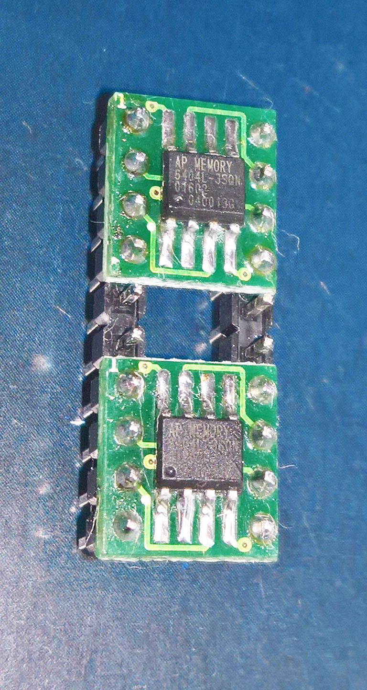
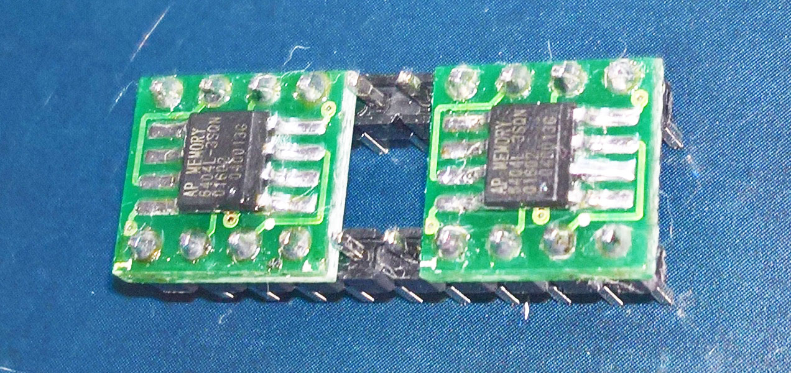
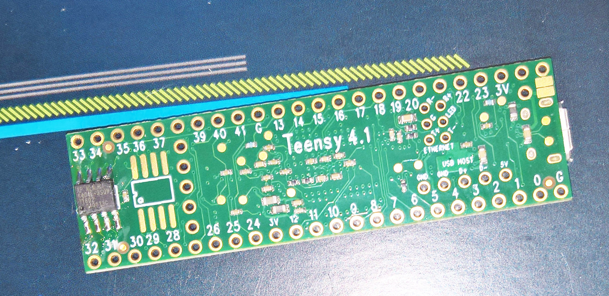

# PSRAM-Applications
A number of 64Mb (8MB) [**AP Memory Technology APS6404L-3SQN QSPI PSRAM**](https://www.mouser.com/ProductDetail/AP-Memory/APS6404L-3SQN-SN?qs=IS%252B4QmGtzzqCot9%252BeIJwKw%3D%3D) had been obtained from [**Mouser (Texas)**](https://www.mouser.com/), and are being tested through their single and quad SPI memory interface modes, for the latter using the RP2040 Pico (for which there is potential r/w QSPI support), and the established QSPI support for the Teensy 4.1 and ESP32's. The comments below should be regarded as a work-in-progress, it is unfinished and documents daily experiments. In addition the copyright of the various code sections belong to their owners as identified by the links provided. Specifically, all Teensy libraries are the property of pjrc.com.

  
 
  
 
  
The separate PSRAM 8-pin DIP module was connected to a Teensy 4.1 (with another PSRAM module soldered to its bottom), and connected to the standard Teensy Audio 3 board revision B as below:
  
Table 1: Connections between PSRAM and Teensy 4.1: 

| PSRAM Pin   | Teensy 4.1 | 
|:------------|:-----------|
| 1           |	6          |
| 2           | 12         | 
| 3   NC      |	      	   | 
| 4           |	GND        | 
| 5           |	11         | 
| 6           | 13         |
| 7           | 3v3        | 
| 8           | 3v3        | 
  
As an initial check the 8MB-PSRAM module was tested with the direct SPI read/write code from here: [**Problem with 23LC1024 RAM memory**](https://forum.pjrc.com/threads/36563-Problem-with-23LC1024-RAM-memory. (Also available here as 23LC1024a.ino)
  
As a second test the Teensy audio code changes as suggested [**here**](https://forum.pjrc.com/threads/29276-Limits-of-delay-effect-in-audio-library/page5), were made, and the PSRAM tested as a direct replacement for the 23LC1024 in the audio external-delay module. But as the delayed audio had some distortion further changes were left for later. The files used are also available here as effect_delay_ext.h, effect_delay_ext.cpp, and PassThroughStereo3.ino
  
As a third test the PSRAM connected to the bottom of the Teensy 4.1 was tested as an audio delay storage device as suggested here: [**Audio Effect Delay Pops & Clicks when changing tap times**](https://forum.pjrc.com/threads/62739-Audio-Effect-Delay-Pops-amp-Clicks-when-changing-tap-times).  The files used are also available here as effect_tapedelay10tap.h, effect_tapedelay10tap.cpp, and tapedelay-example.ino.
  
As this third mapproach worked very well, with no distortion and capable of exceptionally long delays, it will be investigated further.
  
