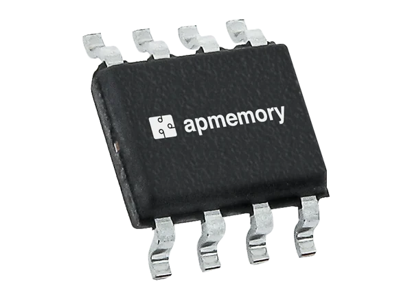
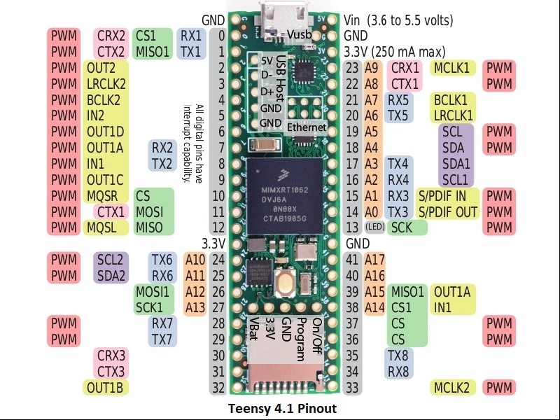
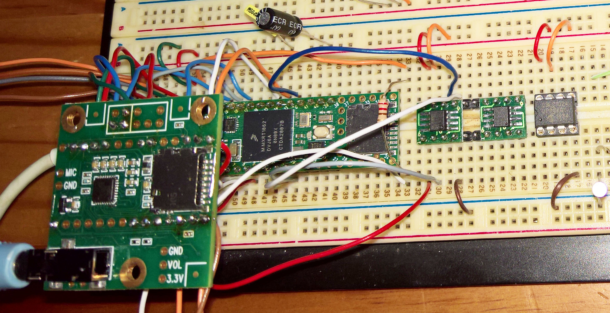
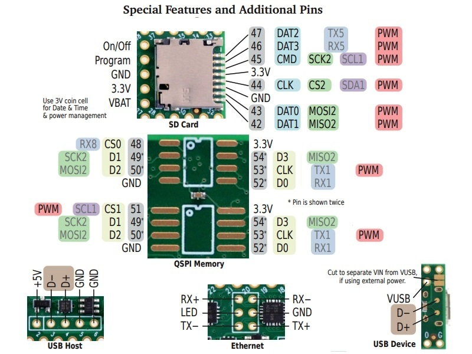
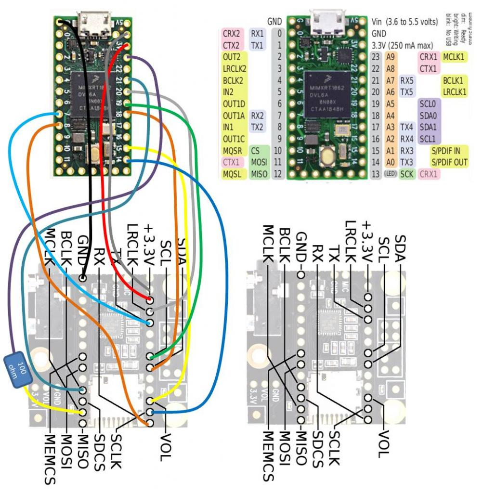

# PSRAM-Applications
A number of 64Mb (8MB) [**AP Memory Technology APS6404L-3SQN QSPI PSRAM ICs**](https://www.mouser.com/ProductDetail/AP-Memory/APS6404L-3SQN-SN?qs=IS%252B4QmGtzzqCot9%252BeIJwKw%3D%3D) had been obtained from [**Mouser (Texas)**](https://www.mouser.com/), and are being tested through their single and quad SPI memory interface modes, for the latter using the RP2040 Pico (for which there is potential PIO-based r/w QSPI support), and the established QSPI support for the [**Teensy 4.1**](https://www.pjrc.com/store/teensy41.html) and ESP32's. 

**Picture 1 and 2.** Two External PSRAM ICs on 8-pin DIP modules and a Teensy 4.1 with another PSRAM IC soldered to its bottom (Note 2).

 
  
 
  
### Method 1. External PSRAM module connected via Teensy SPI0
An external PSRAM 8-pin DIP module was connected to a Teensy 4.1 with another PSRAM IC soldered to its bottom (Note 2), which in turn, was connected to a Teensy Audio 3 board rev B (Note 1) as shown in picture 3 below:
  
**Table 1.** Connections between the external PSRAM module and a Teensy 4.1 (SPI0): 

| PSRAM        | Teensy 4.1  | 
|:-------------|:------------|
| 1  /CE       | 10 CS       |
| 2  SO/SIO[1] | 12 MISO     | 
| 3  SIO[2] NC |	     	     | 
| 4  VSS       | GND         | 
| 5  SI/SIO[0] | 11 MOSI     | 
| 6  SCLK      | 13 SCLK     |
| 7  SIO[3]    | 3v3         | 
| 8  VDD       | 3v3         | 
  
Note: CS pin 6 is used for the Flash and SRAM on the Audioboard
  
**Picture 3.** Two External PSRAM 8-pin DIP modules, a socketed 23LC1024, and a Teensy 4.1 (with another PSRAM IC soldered to its bottom) connected to a Teensy Audio 3 board revision B (Note 1).
  

  
 
  
As an initial check the 8MB-PSRAM module was tested with a modified version of the direct SPI read/write code from here: [**Problem with 23LC1024 RAM memory - 31 August 2016**](https://forum.pjrc.com/threads/36563-Problem-with-23LC1024-RAM-memory). *The modified file used is also available [**here**](/files) as 23LC1024a.ino.*
  
After it was established that the PSRAM can be accessed (read/write) using the same code as for the 23LC1024 SRAM, the Teensy audio code changes as suggested [**here on 12 August 2021**](https://forum.pjrc.com/threads/29276-Limits-of-delay-effect-in-audio-library/page5), were made, where the PSRAM was tested as a direct replacement for the 23LC1024 in the audio external-delay module. But as both the direct and the delayed audio had significant audible distortion with no obvious easy solution,  any further examination were postponed - a possible reason could be gain overload (tried to lower gain of both wet and dry signals via an amplifier), or the two different handlers for the PSRAM that are active at the same time. *The files used are available [**here**](/files) as effect_delay_ext.h, effect_delay_ext.cpp, and PassThroughStereo4.ino.*
  
### Method 2. PSRAM IC directly connected to Teensy 4.1 bottom via QSPI
Using another approach the PSRAM connected to the bottom of the [**Teensy 4.1**](https://www.pjrc.com/store/teensy41.html) (Note 2), was tested as an audio delay storage array, as suggested here: [**Audio Effect Delay Pops & Clicks when changing tap times - 5 September 2020**](https://forum.pjrc.com/threads/62739-Audio-Effect-Delay-Pops-amp-Clicks-when-changing-tap-times). *The files used are available [**here**](/files) as effect_tapedelay10tap.h, effect_tapedelay10tap.cpp, and tapedelay-example.ino.* To compile, keep all three files in the same folder named tapedelay-example.
  
`As this second approach worked very well, with no audible distortion and capable of exceptionally long delays, it will be investigated further.` 

Other similar posts which are aimed at **Teensy audio library objects suitable for PSRAM storage** are: 

* [**Bat Detector (for Teensy 4.1 with 16 MB PSRAM) - 12 Aug 2021**](https://forum.pjrc.com/threads/38988-Bat-detector/page36)
* [**How to read an EXTMEM array within an audio object - 15 Sep 2020**](https://forum.pjrc.com/threads/62491-How-to-read-an-EXTMEM-array-within-an-audio-object?p=252844&viewfull=1#post252844)
* [**Realtime Audio Reversing - 8 Oct 2020**](https://forum.pjrc.com/threads/63608-Realtime-Audio-Reversing-is-it-possible-using-Teensy?p=255500&viewfull=1#post255500) 
* [**Multitrack looper - 28 July 2021**](https://forum.pjrc.com/threads/67816-Audio-project-guidance-multitrack-looper)
* [**MemFile - 29 Aug 2021 - WIP**](https://forum.pjrc.com/threads/68071-memFile) 

Note 1: To connect a Teensy 4.x to an (older) Audio board 3 please refer to [**Teensy 4.0 I2S Support - 14 Aug 2019**](https://forum.pjrc.com/threads/57167-Teensy-4-0-I2S-Support?p=212481%20-%20post212481).
  
Note 2: The Teensy 4.1 use special QSPI pins (48,49,50,52,53,54) to connect to the PSRAM pads at its bottom.  
  
**Important: The copyright of the various code sections and code files, reside with their owners, as identified by the links provided. Specifically, all [Teensy libraries](https://www.pjrc.com/teensy/) are the property of pjrc.com.**
